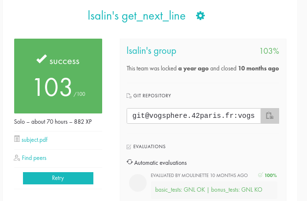

# get_next_line

🇫🇷

Le projet "get_next_line" consiste à créer une fonction capable de lire une ligne à partir d'un descripteur de fichier.

Le code doit respecter la Norme imposée par 42 (voir pdf).

__Comment tester le programme__ ?

* Exécuter la commande `gcc main.c get_next_line.c get_next_line_utils.c`
* Créer un fichier (par exemple test.txt) et remplissez le de phrases
* Exécuter la commande `./a.out test.txt`

__Compétences acquises__ :

* Utilisation des variables statiques
* Interaction avec des descripteurs de fichiers

🇺🇸

The "get_next_line" project consists of creating a function capable of reading a line from a file descriptor.

The code must respect the Norm imposed by 42 (see pdf).

__How to test the program__?

* Execute command `gcc main.c get_next_line.c get_next_line_utils.c`
* Create a file (eg test.txt) and fill it with sentences
* Run the command `./a.out test.txt`

__Acquired skills__:

* Using static variables
* Interaction with file descriptors

